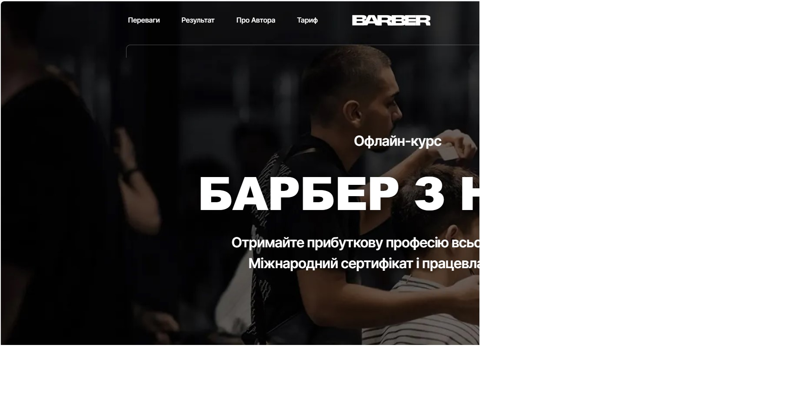

# Barber - A Landing Page Made With Vanilla JS

## Description

This website is a landing page advertising an offline barber training course in
Ukraine.

## Technologies

- Vite (Vanilla JS)
- SaSS
- Email.js
- Notiflix
- Swiper

All images were optimized with Squoosh and are served in WebP format.

## Performance

## Designed by

Vasylyna Plish [Instagram](https://instagram.com/websites.ua?igshid=YzAwZjE1ZTI0Zg==)

## Developer team

- Yurii Buchak [@YuraBuchak](https://github.com/YuraBuchak) [LinkedIn](https://www.linkedin.com/in/yura-buchak)
- Vitaliy Korostylov [@aslanukr](https://github.com/aslanukr) [LinkedIn](https://www.linkedin.com/in/vitaliy-korostylov) 
- Mykhailo Diuzhenko [@dev0652](https://github.com/dev0652) [LinkedIn](https://www.linkedin.com/in/diuzhenko)

