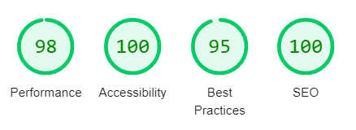

# Barber Training Course Landing Page

Live page: [barber-course.netlify.app](https://barber-course.netlify.app/)

## Description

This website is a landing page advertising an offline barber training course in
Ukraine.

## Technologies

- Vite (Vanilla JS)
- SaSS
- Email.js
- Notiflix
- Swiper

## Performance

All images were optimized with Squoosh and are served in WebP format.

## Designed by

- Vasylyna Plish 

## Developer team

- Yurii Buchak [GitHub](https://github.com/YuraBuchak)
  [LinkedIn](https://www.linkedin.com/in/yura-buchak)
- Vitaliy Korostylov [GitHub](https://github.com/aslanukr)
  [LinkedIn](https://www.linkedin.com/in/vitaliy-korostylov)
- Mykhailo Diuzhenko [GitHub](https://github.com/dev0652)
  [LinkedIn](https://www.linkedin.com/in/diuzhenko)
